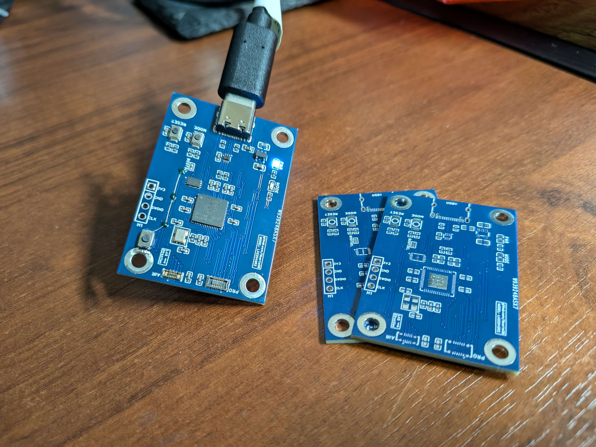
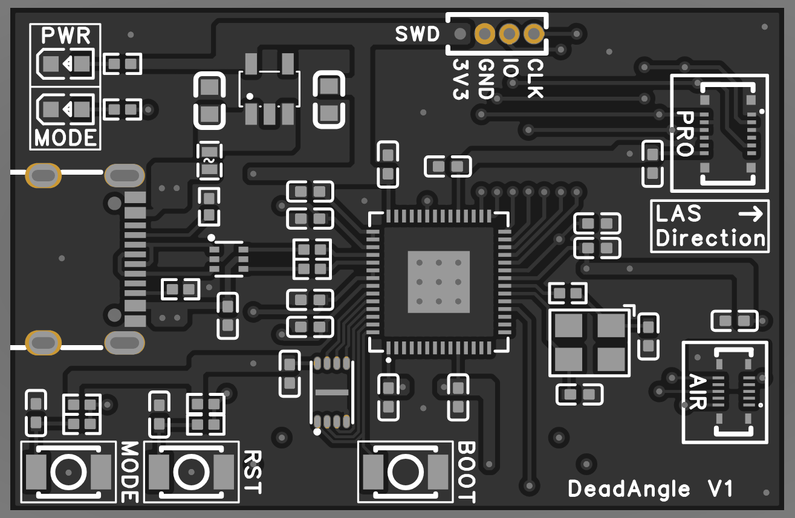
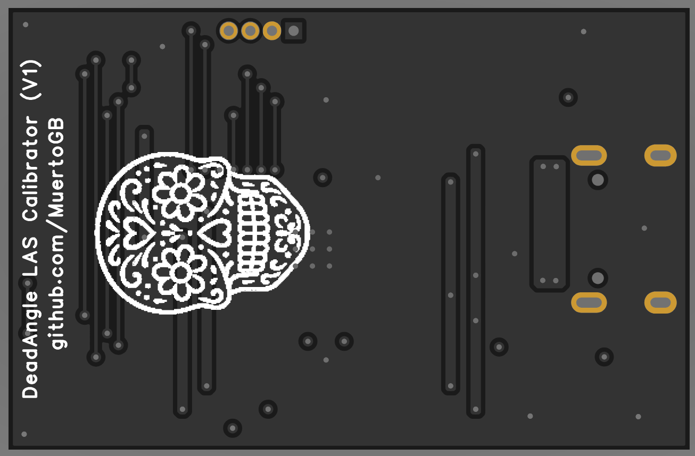

# Deadangle

Deadangle is an open-source project currently in **active development**. Please note that the firmware codebase is **unfinished**, experimental, and subject to significant changes as development continues.

## Status

- 🚧 **Code**: Work in progress, with ongoing improvements.
- 🛠 **Hardware**: Actively being developed, with designs approaching finalization.
- 🏭 **Manufacturing**: Hardware production is planned to begin soon.

## Contributing

Since the project is still evolving, I am not accepting major external contributions at this stage. Feedback and discussion are welcome through GitHub issues and community channels (such as Discord). You can also reach me via the email listed on my GitHub profile. I'd like to thank Dexas for all of their help.

## Disclaimer

This repository is provided **as-is** during development. Expect breaking changes, incomplete features, and rapid iteration as the project moves toward maturity.

## Hardware

The hardware will be released as open-source and available for anyone to manufacture.  

### Initial development board

### Current release design

  
